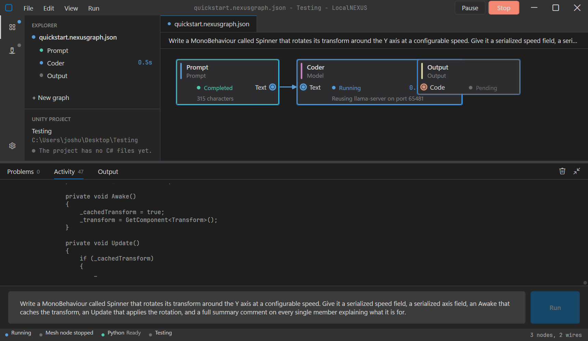
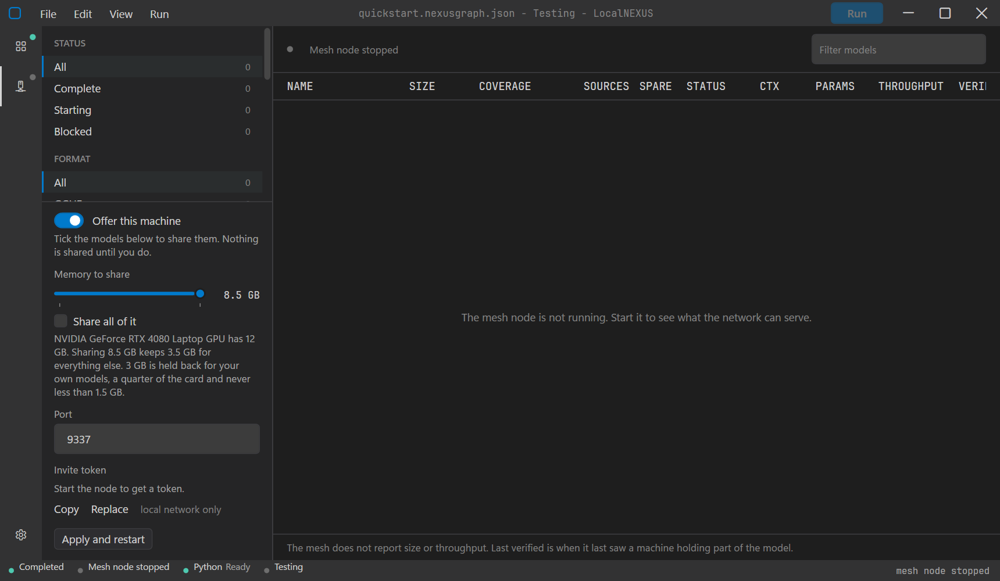

# LocalNEXUS

**Run a team of language models against your own codebase, on your own hardware, and watch
them work.** You wire models together on a canvas, type what you want in plain English, and
the graph reads your project, writes the code, checks it compiles, and puts the files where
they belong.

It is built for people who want the capability of a hosted coding agent without handing over
their source, their API budget, or their choice of model. Unity C# is the first thing it was
pointed at, but nothing in the engine knows what Unity is.

Above: a three node graph part way through a run. The Prompt node has handed on what was
typed, the Model node is generating, the Output node is waiting its turn, and the reply is
streaming into the activity feed as it arrives.

## Why this exists

Point a chat window at a large project and you get confident code that references a class
that does not exist, or quietly adds a second copy of something you already had. The problem
is not the model. It is that the model cannot see the project, and nothing checks its answer
before that answer becomes a file.

LocalNEXUS puts the checks in the pipeline rather than in your review:

- It **indexes the project first** and tells the model what is already there, so a plan can
  say "edit this" instead of always saying "create this".
- It **refuses to create a type that already exists**, and names the file holding it.
- It **compiles the code before writing it**, and hands failures back to the model to fix.
- It **writes all the files or none of them**, so a half applied change never reaches your
  project.
- It **refuses changes that compile but silently break Unity**, such as renaming a
  MonoBehaviour away from the file name Unity binds it by.

Because a graph is just nodes on a canvas, you can put a small fast model on the routine
work and a large one on the thinking, run entirely offline, or split one model across
several machines when it does not fit on yours.

## Status: pre-1.0, and honest about it

This is a working tool that its author uses, not a finished product. Specifically:

- **Solid.** The graph engine, local inference through llama.cpp, the project index, the
  Unity binding rules, staged all-or-nothing writes, themes and the interface. These are
  exercised regularly.
- **Works, lightly exercised.** The safetensors runtime through `transformers serve`, the
  planning and multi file path, and OpenRouter.
- **Never run across two physical machines.** The distributed path has only ever run on one
  machine talking to itself over loopback. Multi consumer routing and surviving a peer being
  killed mid stream were verified that way. Prompt re-convergence after a peer is replaced
  was not. Treat the whole feature as unproven on a real network.
- **Known broken.** The Compiler check node faults the run instead of reporting problems. It
  updates the Problems panel from the run's background thread without marshalling to the UI
  thread, which WPF refuses. Until that is fixed, leave the node out of your graph. No other
  node is affected.

There are no automated tests, and interfaces are still moving. If you build on top of this,
expect to follow along.

## What you need

| | |
|---|---|
| **Operating system** | Windows 11. There is no Linux or macOS build and none is planned yet. |
| **.NET** | Nothing to install. Releases are self contained. |
| **GPU** | Strongly recommended, not required. Developed against an NVIDIA RTX 4080 Laptop with 12 GB. llama.cpp also has Vulkan builds for AMD and Intel, and a processor only build that works but is slow. |
| **Disk** | About 1 GB for the application and its engine binaries, plus whatever your models weigh. |
| **First launch** | Builds an isolated Python environment in the background so safetensors models can be served. On an NVIDIA machine that is roughly 3 GB, downloaded once, because it includes a CUDA build of torch. Without NVIDIA it is a few hundred megabytes. Nothing else waits for it, and GGUF models do not need it at all. |
| **A model** | The tool is only as good as what you wire into it. A 7B class coding model is the realistic floor for useful Unity C#. Below that you will mostly be watching the compile check catch things. Any GGUF or safetensors model works, as does any OpenRouter model. |

Nothing is downloaded without you asking for it, apart from that Python environment.

## Install and run

Take a release, unzip it anywhere, run `LocalNEXUS.exe`. It is a single self contained
executable with its engine binaries beside it, and it writes nothing outside its own folder
and `%LOCALAPPDATA%\LocalNEXUS`.

To build from source instead, see [CONTRIBUTING.md](CONTRIBUTING.md). It takes one command,
but the engine binaries are fetched separately and that is what trips everybody up the first
time.

## Quickstart: from nothing to a generated file

About five minutes, assuming you have a `.gguf` model on disk.

**1. Open a project.** `File > Open Unity project`, and pick a project folder. The status bar
names it and says how many C# files it found. You can point it at any folder; the Unity
rules simply have nothing to enforce if it is not one.

**2. Add your model.** Open the Models panel from the activity bar on the left and add the
folder your `.gguf` lives in, or the file itself. Format is detected by reading the file, so
nothing asks you which engine to use.

**3. Build the smallest useful graph.** From `Edit > Add node`, add a **Prompt**, a **Model**
and an **Output**. Drag from the Prompt node's `Text` pin to the Model node's `Text` pin,
then from the Model node's `Code` pin to the Output node's `Code` pin. Pins only connect
where the types allow, so a wrong wire is refused while you are still dragging it.

**4. Point the Model node at your model.** Click it, and in the inspector on the right choose
Local and pick the model you added.

**5. Say where the file goes.** Click the Output node and set the folder and file name, for
example `Assets/Scripts` and `Spinner.cs`.

**6. Run it.** Type into the box at the bottom:

> Write a MonoBehaviour called Spinner that rotates its transform around the Y axis at a
> configurable speed, with a serialized field for the speed.

Press **Run**, or Ctrl+Enter. The first run with a model takes a few seconds to load it into
memory; after that the server is reused. Each node lights up in turn, the reply streams into
the activity feed, and a final line names the file that was written and how many lines
changed.

That is the whole loop. Everything else is more nodes in the middle of it.

## Sharing compute, and using someone else's

A model too large for your machine can be run across several. LocalNEXUS starts a
[Mesh LLM](https://github.com/Mesh-LLM/mesh-llm) node, which handles discovery, splits a
model into contiguous layer stages and places them on whoever has room. The Network tab
lists what the network can serve, how many machines cover each part of a model, and whether
there is spare cover if one of them drops.

You choose what you offer: a switch for the machine, a tick per model, and a memory limit
that defaults to leaving a quarter of your card free for your own work. The mesh is private
and local network only unless you explicitly publish it.

Read the status section above before relying on any of this.

## Where it is going

The long term goal is a network where people pool compute to collectively run large open
weight models none of them could run alone. That shapes decisions now: sources are
interchangeable rather than "my machine" and "the remote one", identity is a persistent
public key so reputation can attach to it later, and coverage is computed properly even when
there are only two machines and it always passes.

Nearer term:

- Fix the Compiler check threading bug and exercise the repair loop properly.
- A Loop node, once a node can drive the nodes downstream of it.
- Breakpoints on wires, to pause a run and edit a value in flight.
- Memory that survives between runs.
- Editing and deleting files from the Output node, not only writing.
- Anything at all across two physical machines.

Trust scoring and any notion of contribution economics are deliberately not designed yet.
They need real use first.

## Documentation

- [Models](docs/models.md), local and hosted, and the Python runtime
- [Working with a Unity project](docs/unity-projects.md), the index, the rules, the compile check
- [Distributed inference](docs/distributed.md)
- [The window](docs/interface.md), themes and settings
- [Architecture](docs/architecture.md) and project layout
- [Contributing](CONTRIBUTING.md), including how to get the engine binaries

## Contributing

Issues and pull requests are welcome. [CONTRIBUTING.md](CONTRIBUTING.md) covers building from
a clean clone, how the pieces fit together, and which parts are deliberately left alone.
Please read [CODE_OF_CONDUCT.md](CODE_OF_CONDUCT.md) as well. Security problems go through
[SECURITY.md](SECURITY.md) rather than a public issue.

## Licence

Apache-2.0. Copyright 2026 You Know Its Me Studios. See [LICENSE](LICENSE), and
[NOTICE](NOTICE) for the third party components and their licences.

Engine binaries you place in `vendor/` and any model weights you download carry their own
licences and are not covered by this repository.
